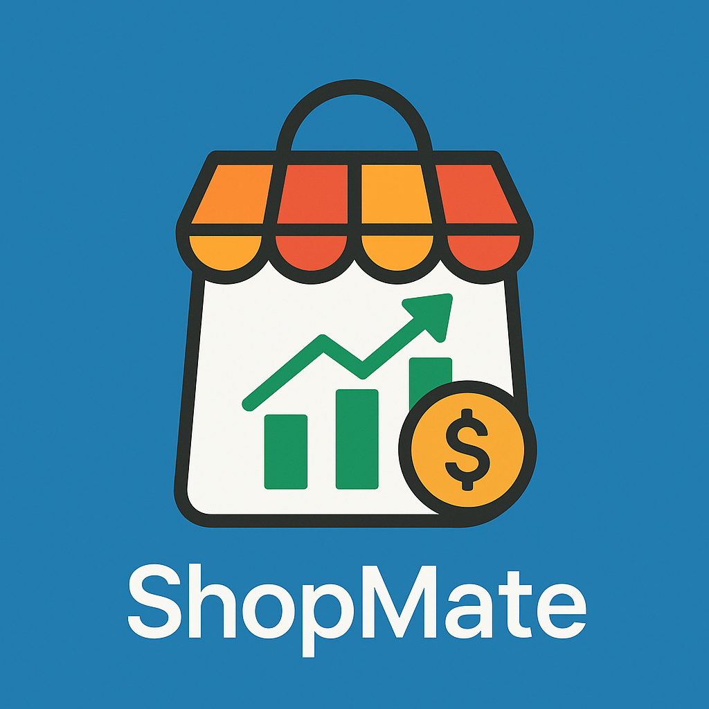
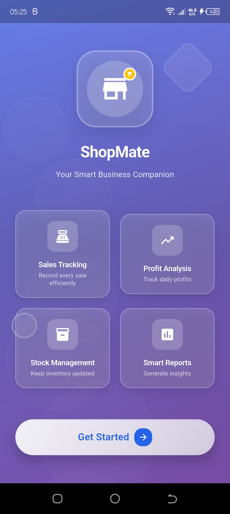
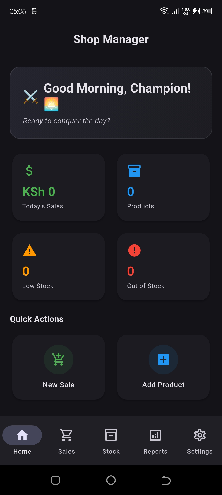
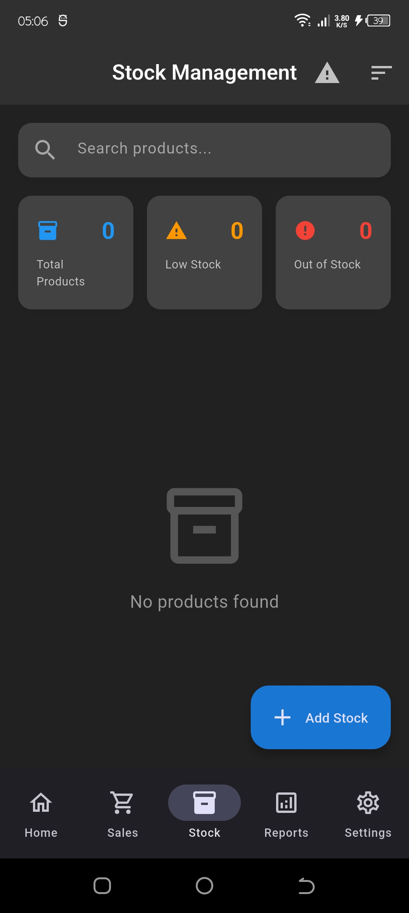
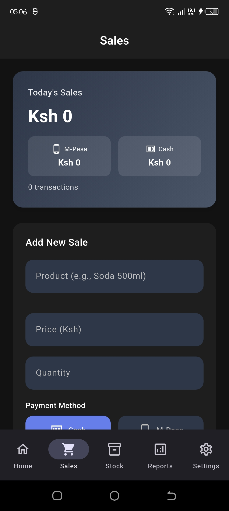
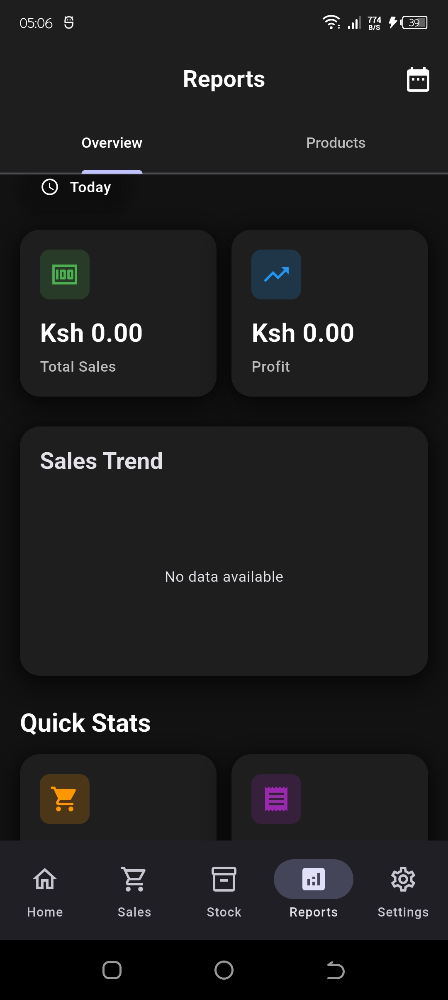
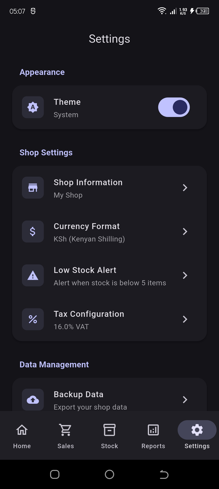

# 🛍️ ShopMate

> Your smart shop assistant for efficient inventory and sales management

ShopMate is a modern Flutter application that empowers shop owners to efficiently manage inventory, record sales, track profits, and receive timely alerts for low or out-of-stock items. With an intuitive interface and insightful analytics, ShopMate helps you make data-driven business decisions.

[](https://flutter.dev)
[](https://opensource.org/licenses/MIT)
[](http://makeapullrequest.com)

<p align="center">
  
  </p>
---

## ✨ Features

### 🎯 Dashboard & Overview
- **Real-time Analytics**: View today's sales, product count, and inventory alerts at a glance
- **Quick Actions**: Instantly add sales or products with one tap
- **Smart Alerts**: Automatic notifications for low stock and out-of-stock items

### 📦 Stock Management
- **Complete Product Control**: Add, edit, and delete products with comprehensive details
- **Detailed Tracking**: Monitor category, supplier, pricing, cost, and expiry dates
- **Financial Insights**: Track total investment, current stock value, and profit per product
- **Advanced Filtering**: Search, sort, and filter products by multiple criteria
- **Stock Alerts**: Real-time notifications for inventory levels

### 💰 Sales Management
- **Quick Sales Recording**: Log sales with product, quantity, price, and payment method
- **Payment Flexibility**: Support for Cash and M-Pesa transactions
- **Comprehensive History**: View and filter all sales by date, product, or payment method
- **Automatic Processing**: Real-time stock deduction and profit calculation

### 📊 Reports & Analytics
- **Visual Insights**: Interactive line and bar charts for sales trends
- **Time Periods**: Analyze performance by day, week, month, or year
- **Performance Metrics**: Track top products and product-wise analytics
- **Key Statistics**: Monitor total sales, profit, transactions, and items sold
- **Export Capability**: Generate reports for external analysis *(coming soon)*

### ⚙️ Settings & Customization
- **Theme Support**: Switch between light and dark modes
- **Personalization**: Customize app preferences to match your workflow
- **User-Friendly**: Clean and intuitive settings interface

---

## 🛠️ Tech Stack

| Technology | Purpose |
|------------|---------|
| **Flutter** | Cross-platform UI framework |
| **Dart** | Programming language |
| **Provider** | State management solution |
| **SQLite** | Local database storage via `sqflite` |
| **fl_chart** | Data visualization and charts |
| **Lottie** | Beautiful animations |
| **flutter_animate** | Advanced animation effects |

---

## 🚀 Getting Started

### Prerequisites

Before you begin, ensure you have the following installed:
- [Flutter SDK](https://flutter.dev/docs/get-started/install) (3.0 or higher)
- Dart SDK (included with Flutter)
- An IDE: [Android Studio](https://developer.android.com/studio), [VS Code](https://code.visualstudio.com/), or [IntelliJ IDEA](https://www.jetbrains.com/idea/)

### Installation

Follow these steps to set up the project locally:

1. **Clone the repository**
   ```bash
   git clone https://github.com/jude-craft/shop_mate.git
   cd shop_mate
   ```

2. **Install dependencies**
   ```bash
   flutter pub get
   ```

3. **Run the app**
   ```bash
   # For development
   flutter run
   
   # For specific device
   flutter run -d <device_id>
   
   # For release build
   flutter run --release
   ```

4. **Build for production** *(optional)*
   ```bash
   # Android APK
   flutter build apk --release
   
   # Android App Bundle
   flutter build appbundle --release
   
   # iOS
   flutter build ios --release
   ```

---

## 📁 Project Structure

```
shop_mate/
├── lib/
│   ├── main.dart                 # Application entry point
│   └── src/
│       ├── features/
│       │   ├── screens/
│       │   │   ├── home/         # Home dashboard & overview
│       │   │   ├── stock/        # Inventory management
│       │   │   ├── sales/        # Sales recording & history
│       │   │   ├── reports/      # Analytics & insights
│       │   │   └── welcome/      # Onboarding experience
│       │   ├── providers/        # State management
│       │   ├── models/           # Data models & entities
│       │   ├── theme/            # App theming & styles
│       │   └── widgets/          # Reusable UI components
├── assets/
│   ├── images/                   # App icons & graphics
│   └── animations/               # Lottie animations
├── test/                         # Unit & widget tests
└── pubspec.yaml                  # Project dependencies
```

---

## 📸 Screenshots


<p align="center">
  
  
  
  
  
  
</p>


---

## 🤝 Contributing

We welcome contributions from the community! Here's how you can help:

1. **Fork the repository**
2. **Create a feature branch** (`git checkout -b feature/AmazingFeature`)
3. **Commit your changes** (`git commit -m 'Add some AmazingFeature'`)
4. **Push to the branch** (`git push origin feature/AmazingFeature`)
5. **Open a Pull Request**

### Contribution Guidelines
- Follow the existing code style and structure
- Write clear commit messages
- Add tests for new features
- Update documentation as needed
- Ensure all tests pass before submitting PR

For major changes, please open an issue first to discuss what you would like to change.

---

## 🐛 Bug Reports & Feature Requests

Found a bug or have a feature suggestion? Please check the [issues page](https://github.com/jude-craft/shop_mate/issues) and create a new issue if it doesn't already exist.

---

## 📝 License

This project is licensed under the MIT License - see the [LICENSE](LICENSE) file for details.

```
MIT License

Copyright (c) 2025 ShopMate

Permission is hereby granted, free of charge, to any person obtaining a copy
of this software and associated documentation files...
```

---

## 👨‍💻 Author

**Jude Craft**
- GitHub: [@jude-craft](https://github.com/jude-craft)

---

## 🙏 Acknowledgments

- Flutter team for the amazing framework
- Contributors and supporters of this project
- All the open-source packages used in this project

---

## 📞 Support

If you find this project helpful, please consider:
- ⭐ Starring the repository
- 🐛 Reporting bugs
- 💡 Suggesting new features
- 📖 Improving documentation

---

<p align="center">
  <strong>ShopMate</strong> – <em>Simplifying shop management, one transaction at a time</em>
</p>

<p align="center">Made with ❤️ using Flutter</p>
